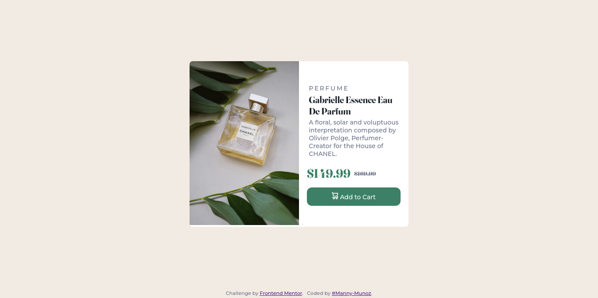

# Frontend Mentor - Product preview card component

This is a solution to the [Product preview card component challenge on Frontend Mentor](https://www.frontendmentor.io/challenges/product-preview-card-component-GO7UmttRfa). Frontend Mentor challenges help you improve your coding skills by building realistic projects. 

## Table of contents

- [Overview](#overview)
  - [Screenshot](#screenshot)
  - [Links](#links)
- [My process](#my-process)
  - [Built with](#built-with)
- [Author](#author)

## Overview

### Screenshot



### Links

- Solution URL: []()
- Live Site URL: [manny-munoz.github.io/Product-Preview-Card-Frontend-Mentor-Challenge](https://manny-munoz.github.io/Product-Preview-Card-Frontend-Mentor-Challenge/)

## My process

### Built with

- Semantic HTML5 markup
- CSS custom properties
- Flexbox
- CSS Grid
- Mobile-first workflow


### What I Learned

I learned that if a hover it's needed to add, it can be add a media query `hover` to make sure that it will only be shown if and only the device where it is displaying does have a mouse.
```css
@media (hover:hover){
  .card__button:hover{
    filter: brightness(75%)
  }
}
```

### Useful resources

- [Hover media query](https://developer.mozilla.org/en-US/docs/Web/CSS/@media/hover) - This helps me to understand the hover media query feature

## Author

- Frontend Mentor - [@Manny-Munoz](https://www.frontendmentor.io/profile/Manny-Munoz)
